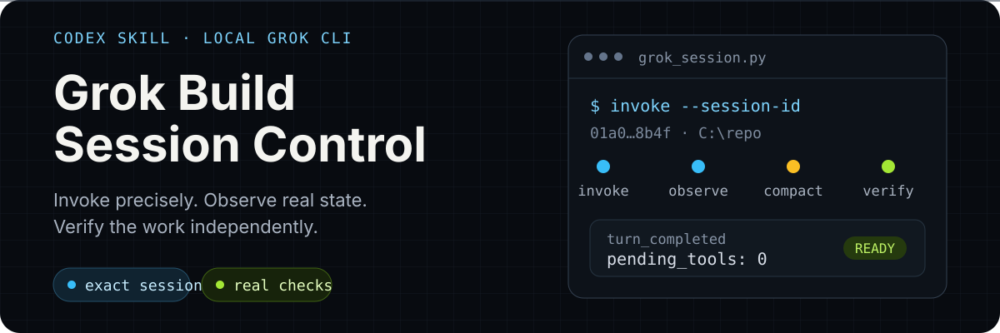

<p align="center">
  
</p>

<p align="center">
  <strong>English</strong> · <a href="./README.zh-CN.md">简体中文</a>
</p>

<p align="center">
  <a href="./docs/getting-started.md">Quick start</a> ·
  <a href="./docs/commands.md">Command reference</a> ·
  <a href="./docs/session-lifecycle.md">Session lifecycle</a> ·
  <a href="./docs/troubleshooting.md">Troubleshooting</a> ·
  <a href="./SKILL.md">Skill instructions</a>
</p>

# Codex Grok Build Session

Use Codex to create, resume, supervise, and verify local Grok Build CLI sessions. The skill turns working directories, session IDs, events, context usage, and logs into an inspectable collaboration workflow while preserving Grok's native sessions.

> Designed for Windows, PowerShell, Codex Skills, and the local Grok Build CLI. The current implementation has been exercised against Grok 1.0.5; runtime behavior still follows your local `grok --help` and `grok models` output.

## What it solves

Directly launching an external coding agent often creates four recurring problems: resuming the wrong session, using a mismatched working directory, treating process exit as completed work, and reading context usage incorrectly. This skill gives Codex a reviewable operating method:

- Find sessions by their exact owner directory and verify session ID ownership.
- Create or resume headless Grok sessions while retaining prompt, stdout, stderr, and debug logs.
- Combine `turn_completed`, pending tool calls, file stability, processes, and ports when judging activity.
- Read context from `signals.json` and recent events, then send `/compact` as a separate turn when needed.
- Run a real smoke test after Grok updates and remove only the test session created by that run.
- Let Codex independently inspect diffs, builds, tests, web pages, and screenshots after Grok implements a task.

## How it works

<p align="center">
  
</p>

1. **Diagnose** — inspect the CLI, models, doctor output, session store, and active PIDs.
2. **Invoke** — create a session in an authorized directory or resume an exact ID.
3. **Observe** — read state files, events, context, and logs before deciding what happens next.
4. **Verify** — inspect the repository and run the project's own verification commands.

## Five-minute quick start

### 1. Install

You need Python 3.10+, an installed and authenticated Grok Build CLI, and a Codex version that supports Skills.

```powershell
git clone https://github.com/ZiChenWang114514/codex-grok-build-skill.git `
  "$env:USERPROFILE\.codex\skills\codex-grok-build"
```

If the destination already exists, inspect its local changes before choosing how to update it.

### 2. Check the environment

```powershell
python "$env:USERPROFILE\.codex\skills\codex-grok-build\scripts\grok_session.py" `
  status --json
```

A successful result reports the Grok version, default and available models, required flags, doctor status, session store, and active sessions.

### 3. Run the compatibility smoke test

After first installation or a Grok update, create one short session in a safe directory:

```powershell
python "$env:USERPROFILE\.codex\skills\codex-grok-build\scripts\grok_session.py" `
  smoke-test --dir "C:\path\to\safe-dir" --json
```

The test disables tools, subagents, planning, and web search. After validating the exact reply and actual model, it removes the test session and its default temporary logs.

### 4. Create a coding session

Save a longer task as a UTF-8 text file:

```powershell
python "$env:USERPROFILE\.codex\skills\codex-grok-build\scripts\grok_session.py" `
  invoke --dir "C:\path\to\repo" `
  --prompt-file "C:\path\to\phase.txt" --json
```

The response includes `session_id`, actual model usage, reply, stop reason, and log directory. To resume the same session, use its original working directory:

```powershell
python "$env:USERPROFILE\.codex\skills\codex-grok-build\scripts\grok_session.py" `
  invoke --dir "C:\path\to\repo" `
  --session-id "<session-id>" `
  --prompt-file "C:\path\to\next-phase.txt" --json
```

## Command map

| Command | Purpose | Changes session state |
|---|---|:---:|
| `status` | Check installation, models, doctor, and active sessions | No |
| `list` | List sessions owned by an exact working directory | No |
| `inspect` | Inspect events, context, and PIDs for one session ID | No |
| `wait` | Compare session files and events across a short interval | No |
| `invoke` | Create or resume a headless Grok session | Yes |
| `smoke-test` | Create, validate, and remove one test session | Yes, then cleans up |

See the [command reference](./docs/commands.md) for every option and response field.

## Operational safety

- Normal invocations preserve the Grok session and logs for later inspection.
- The helper refuses to overwrite standard invocation logs in a user-specified directory.
- On timeout, it stops only the process tree started by that invocation and reports candidate sessions and logs.
- The helper does not commit, push, publish, deploy, or change global Grok or Claude configuration by itself.
- `--always-approve` is added only when the caller explicitly supplies it.
- Authentication tokens and proxy credentials should never appear in prompts, repositories, or public logs.

## Documentation

| Document | Covers |
|---|---|
| [Getting started](./docs/getting-started.md) | Installation, first checks, creating and resuming sessions |
| [Command reference](./docs/commands.md) | Commands, options, responses, and exit behavior |
| [Session lifecycle](./docs/session-lifecycle.md) | Session discovery, completion checks, context, and long-running work |
| [Troubleshooting](./docs/troubleshooting.md) | Startup, networking, timeouts, warnings, processes, and logs |
| [Design notes](./docs/design.md) | Data sources, helper responsibilities, and safety design |

## Repository layout

```text
.
├── SKILL.md                         # Instructions used by Codex
├── scripts/grok_session.py          # Session helper
├── references/                      # Runtime notes and defaults
├── docs/                            # English documentation
│   └── zh-CN/                       # Chinese documentation
├── assets/readme/                   # README SVG assets
├── agents/openai.yaml               # Skill display metadata
└── evals/evals.json                 # Behavioral evaluation cases
```

## Compatibility

- **Operating system** — Windows PowerShell is the primary tested environment.
- **Python** — 3.10 or newer is required.
- **Grok CLI** — tested with 1.0.5; model names, flags, and session files may change across versions.
- **Model selection** — the helper reads `grok models` and does not hard-code a legacy model ID.

When reporting a version difference, include `status --json`, `grok --version`, and relevant logs after removing sensitive data.

## License

[MIT](./LICENSE) © 2026 ZiChenWang114514
